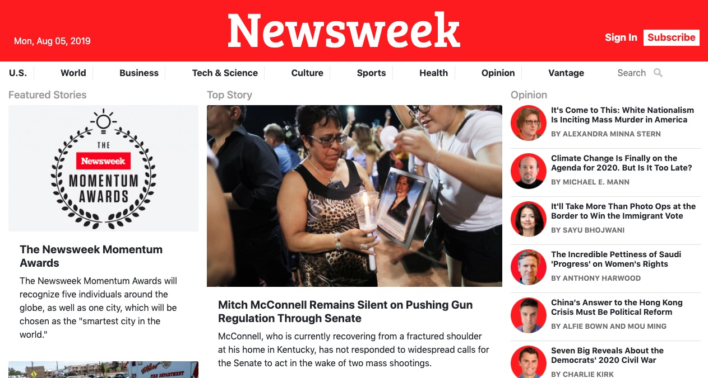

# BOOTSTRAP/NEWSWEEK CLONE

The aim of this project was to build a responsive clone of the "newsweek.com" homepage using bootstrap.

  

## Live Demo

Click [here](https://kerronking.github.io/Bootstrap-Newsweek-Clone/) to see a live demo.

## Built With

This app was built using the following:
- HTML5
- CSS3
- Bootstrap 4

## Contributing

Contributions, issues and feature requests are welcome!

## Show your support

Feel free to drop a :+1: to show your support. It'd be greatly appreciated it :pray:

## Author

:bust_in_silhouette: Kerron King

* Github: [@KerronKing](https://github.com/KerronKing)

* Twitter: [@KerronTriniDev](https://twitter.com/kerrontrinidev)

* Linkedin: [Kerron King](linkedin.com/in/kerron-shawn-king)
